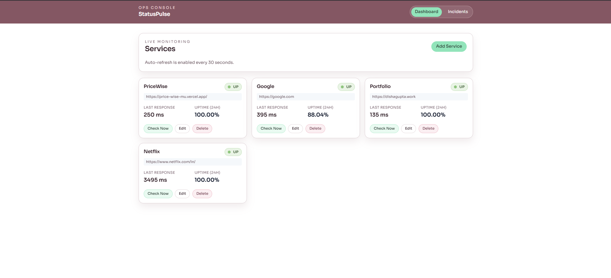
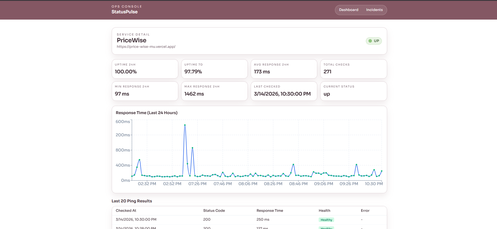
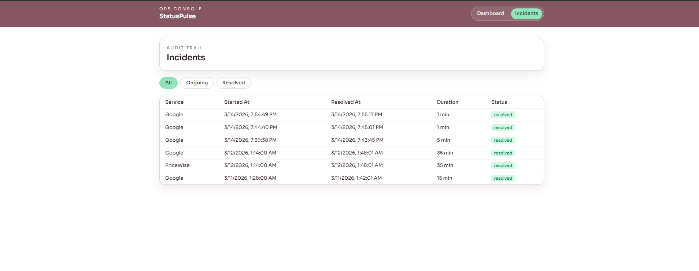
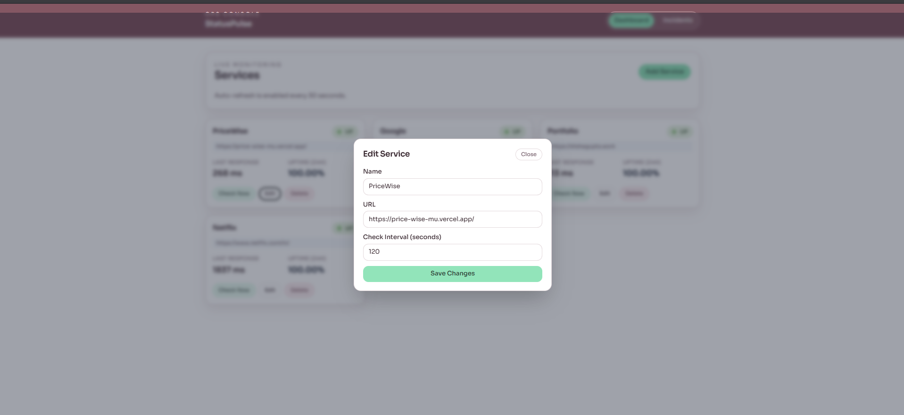

# StatusPulse

StatusPulse is a full-stack monitoring dashboard for tracking service uptime, response time, and incident history. It periodically checks registered services, stores health results in PostgreSQL, uses Redis for current-status caching and incident counters, and presents the data in a React dashboard.

## Features

- Add, edit, delete, and inspect monitored services
- Run scheduled health checks for active services
- Track uptime, response-time trends, and ping history
- Detect incidents after consecutive failures and resolve them automatically
- Send Slack alerts on incident start and resolution
- View dashboard, service detail, and incident history pages
- Run PostgreSQL, Redis, and backend API in Docker for local development

## Tech Stack

- Frontend: React, Vite, Recharts, Tailwind CSS
- Backend: Node.js, Express, Axios, node-cron
- Notifications: Slack Incoming Webhooks
- Data: PostgreSQL, Redis
- Dev tooling: Docker Compose

## Architecture

```text
Frontend (React/Vite on localhost:5173)
    |
    v
Backend API (Express on localhost:3000)
    |--------------------|
    v                    v
PostgreSQL           Redis
(services, pings,    (latest status cache,
 incidents)           failure counters)
```

### Backend Flow

1. The cron worker loads active services from PostgreSQL every 2 minutes.
2. Each service is checked via HTTP using Axios.
3. Ping results are saved in PostgreSQL.
4. Redis stores the latest service status and consecutive failure counts.
5. Incident start/resolution can trigger Slack alerts through an incoming webhook.
6. The dashboard polls the backend every 30 seconds for updated data.

## Screenshots

### Dashboard Page



### Service Detail Page



### Incidents Page



### Add/Edit Service Modal



## API Summary

### Service Management

- `GET /api/services` - list all services with current status and uptime
- `GET /api/services/:id` - fetch one service
- `POST /api/services` - create a service
- `PUT /api/services/:id` - update a service
- `DELETE /api/services/:id` - delete a service
- `POST /api/services/:id/check` - trigger a manual health check

### Metrics and History

- `GET /api/services/:id/stats` - fetch current stats for a service
- `GET /api/services/:id/history?limit=100` - fetch recent ping history

### Incidents

- `GET /api/incidents` - list all incidents
- `GET /api/incidents?status=ongoing` - list only ongoing incidents
- `GET /api/incidents?status=resolved` - list only resolved incidents
- `GET /api/services/:id/incidents` - list incidents for one service

## Database Setup

Run backend migrations to ensure the required tables exist:

```bash
cd backend
npm run migrate
```

This creates or confirms the presence of:
- `services`
- `ping_results`
- `incidents`
- `schema_migrations`

## Local Development Setup

### 1. Start local infrastructure and backend

This starts:
- PostgreSQL in Docker
- Redis in Docker
- Backend API in Docker on `http://localhost:3000`

```bash
docker compose -f docker-compose.dev.yml up -d
```

### 2. Check container status

```bash
docker compose -f docker-compose.dev.yml ps
```

### 3. Run database migrations

```bash
cd backend
npm run migrate
```

### 4. Start frontend locally

```bash
cd frontend
npm run dev
```

If needed, set:

```bash
VITE_API_URL=http://localhost:3000
```

If you want Slack incident alerts, also add this in `backend/.env`:

```bash
SLACK_WEBHOOK_URL=https://hooks.slack.com/services/<YOUR>/<WEBHOOK>/<URL>
```

For frontend access in development or deployment, set:

```bash
FRONTEND_ORIGIN=http://localhost:5173
```

### 5. Open the app

- Frontend: `http://localhost:5173`
- Backend health endpoint: `http://localhost:3000/health`

## Slack Alerting

The backend can send Slack alerts when:
- an incident starts after 3 consecutive failed checks
- an incident resolves after the next healthy check

Setup:

1. Create a Slack app in your workspace
2. Enable Incoming Webhooks
3. Add a webhook for your alerts channel
4. Copy the webhook URL into `backend/.env` as `SLACK_WEBHOOK_URL`

The app treats Slack as best-effort. If Slack is unavailable or misconfigured, incident tracking still works and the backend logs a warning instead of crashing.

## Stop the Stack

```bash
docker compose -f docker-compose.dev.yml down
```

To remove persisted Docker data as well:

```bash
docker compose -f docker-compose.dev.yml down -v
```
